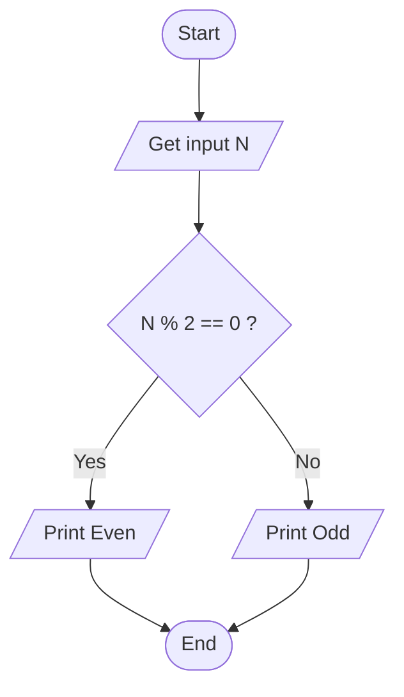
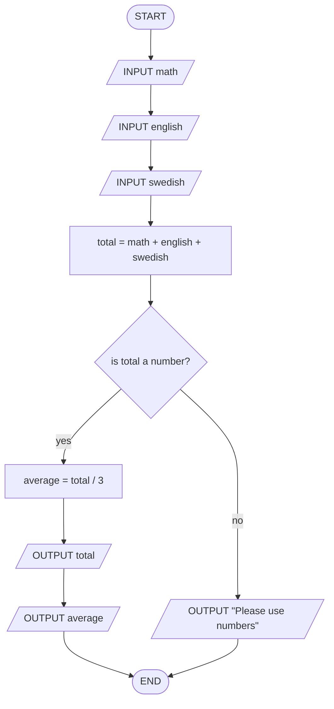
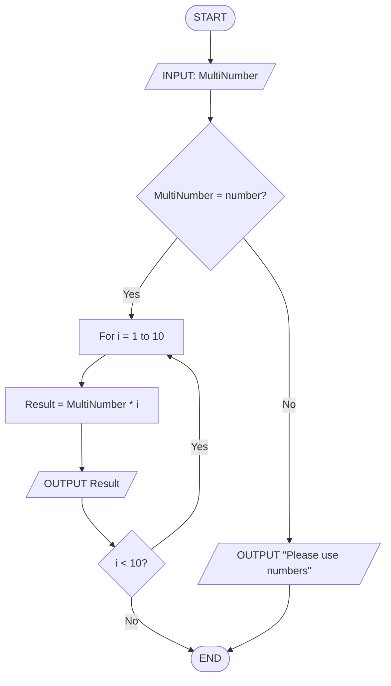
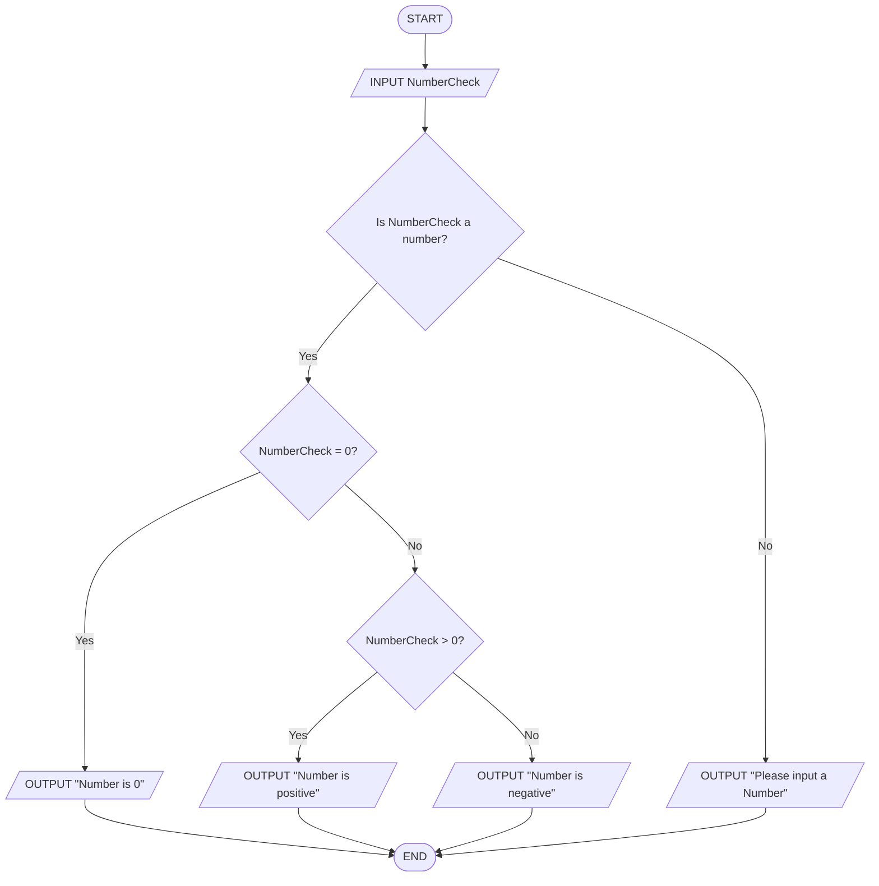
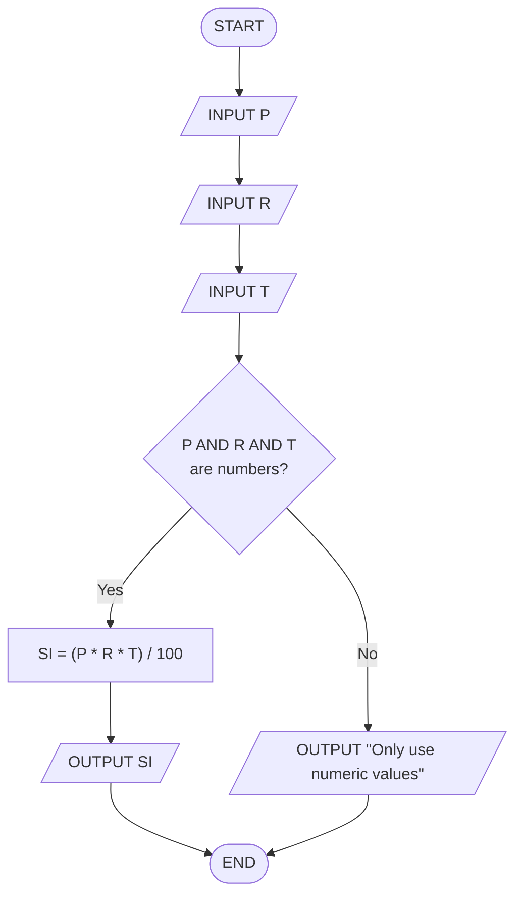
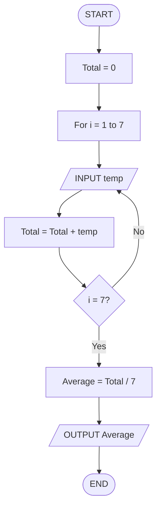
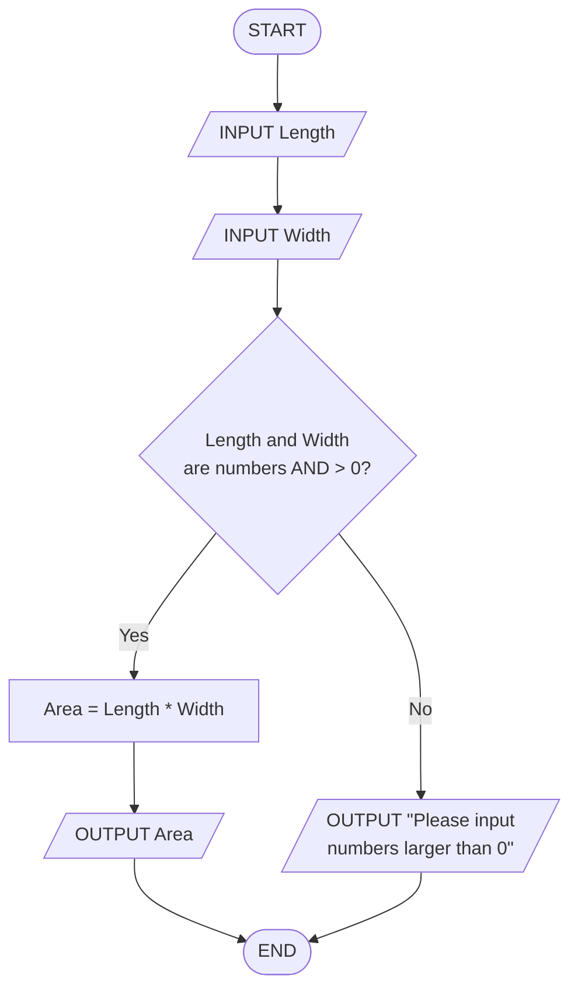
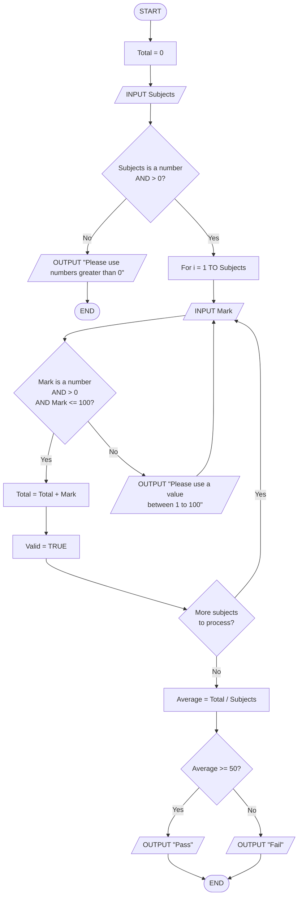
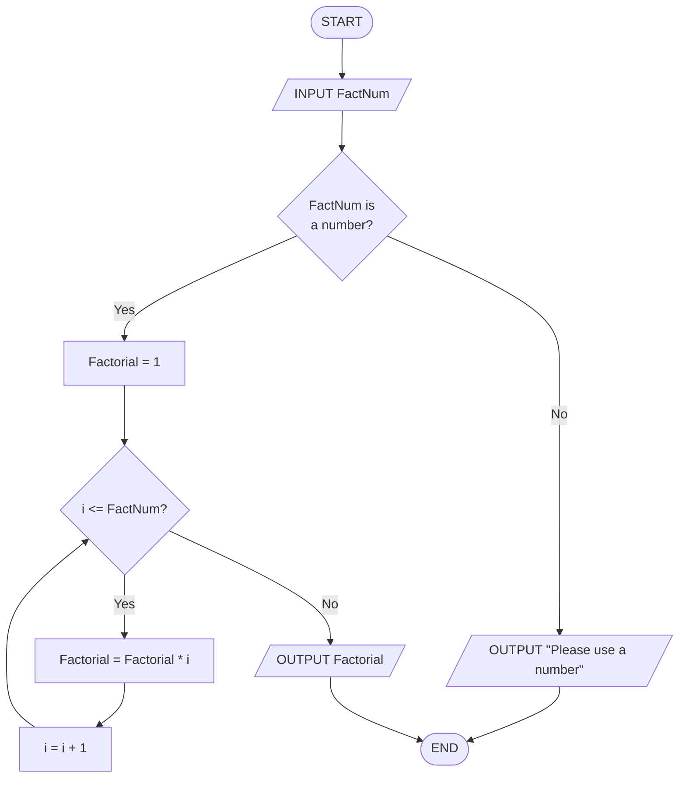
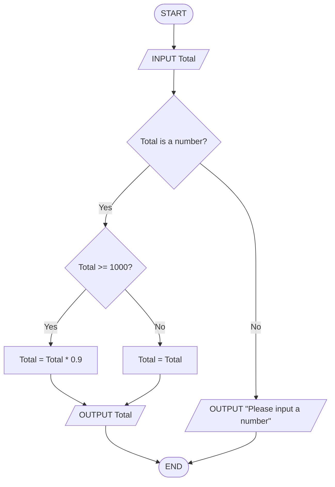

## 1. Check Even or Odd Number

Design an algorithm and flowchart that take a number as input and
determine whether it is even or odd.

### ✔ Pseudocode

```text
START
    INPUT number
    IF number % 2 == 0 THEN
        PRINT Even
    ELSE
        PRINT Odd
    ENDIF
END
```

### ✔ Flowchart



---

## 2. Calculate Total and Average Marks

Write the algorithm and draw the flowchart for a program that inputs
marks for 3 subjects, calculates the total and average, and displays
both.

### ✔ Pseudocode

```text
START
    INPUT math
    INPUT english
    INPUT swedish
    total = math + english + swedish
    if total is a number then
        average = total / 3
        OUTPUT total
        OUTPUT average
    else
        OUTPUT "Please use numbers"

END

```


---

## 3. Display Multiplication Table

Create an algorithm and flowchart that input a number and display its
multiplication table from 1 to 10 using a loop.

```text
START
    INPUT MultiNumber
    If MultiNumber = number then
        for i = 1 to 10
            Result = MultiNumber * i
            OUTPUT Result
    Else
        OUTPUT "Please use numbers"

END
```


---

## 4. Positive, Negative, or Zero Check

Write the algorithm and flowchart to input a number and display whether
it is positive, negative, or zero.

```text
START
    Input NumberCheck
    If NumberCheck is number Then
        If NumberCheck = 0 Then
            OUTPUT "Number is 0"
        Else If NumberCheck > 0
                OUTPUT "Number is positive"
        Else
                OUTPUT "Number is negative
    Else
        OUTPUT "Please input a Number"
END

```

---

## 5. Simple Interest Calculator

Create an algorithm and flowchart for a program that calculates simple
interest using the formula:

**SI = (P × R × T) / 100**

- **P = Principal** → original amount of money
- **R = Rate of Interest** → percentage per year
- **T = Time** → number of years

```text
START
    INPUT P
    INPUT R
    INPUT T
    IF P AND R AND T is a number Then
        SI = (P * R * T) / 100
        OUTPUT SI
    Else 
        OUTPUT "Only use numeric values"
END
```

---

## 6. Average Temperature Calculation

Write the algorithm and draw the flowchart for a program that takes the
temperature of 7 days, finds the average temperature, and displays it.

```text
START
    Total = 0
    For i = 1 to 7
        INPUT temp
        Total = Total + temp
    END For
    Average = Total / 7
    OUTPUT Average
END
```


---

## 7. Calculate Area of a Rectangle

Create an algorithm and flowchart to input length and width, calculate
the area (**Area = Length × Width**), and display the result.

```Text
START
    INPUT Length
    INPUT Width
    If Length is a number AND Width is a number AND Length > 0 AND Width > 0 Then
        Area = Length * Width
        OUTPUT Area
    Else
        OUTPUT "Please input numbers larger than 0"
    END If
END
```

---

## 8. Determine Pass or Fail

Write the algorithm and draw the flowchart for a program that takes a
student's average marks and displays **"Pass"** if average ≥ 50,
otherwise **"Fail"**.

```text
START
    Total = 0
    INPUT Subjects
    IF Subjects is a number AND > 0 Then
        For i = 1 TO Subjects
        REPEAT
            INPUT Mark
            If Mark is a number and > 0 AND Mark <= 100 Then
                Total = Total + Mark
                Valid = TRUE
            Else
                OUTPUT "Please use a value between 0 to 100"
                Valid = FALSE
            End If
        UNTIL Valid = TRUE
    Else
        OUTPUT "Please use numbers greater than 0"

    Average = Total / Subjects
    If Average >= 50 Then
        Output "Pass"
    Else
        OUTPUT "Fail"
END
```


---

## 9. Calculate Factorial of a Number

Write the algorithm and draw the flowchart that input a number and
calculate its factorial using a loop.
```text
START
    
    INPUT FactNum

    Factorial = 1
        If FactNum is a number Then
            For i = 1 to FactNum
                Factorial = Factorial * i
            END For
        Else
            OUTPUT "Please use a number"
        END If
    OUTPUT Factorial
END
```


---

## 10. Calculate Discount on Purchase

Write the algorithm and draw the flowchart for a program that inputs the
purchase amount and gives a **10% discount** if the amount is greater
than 1000.

```text
START
    INPUT Total
    If Total is a number Then
        If Total is >= 1000 Then
            Total = Total * 0.9
        Else
            Total = Total
        End If
    Else
        OUTPUT = "Please input a number"
    END If
    OUTPUT Total

END
```


---


## Optional Exercises (11–16)

## 11. Online Shopping Delivery Eligibility

Write the algorithm and draw the flowchart for a program that inputs a
customer's purchase amount and displays **"Free Delivery"** if the
amount is 500 SEK or more; otherwise display **"Delivery Charge
Applies"**.

---

## 12. Employee Salary and Bonus Calculator

Write the algorithm and draw the flowchart for a program that inputs an
employee's monthly salary and years of service, calculates a bonus of
**10%** for employees with 5 or more years of service and **5%** for
others, then displays the bonus and total salary.

---

## 13. Mobile Data Usage Monitor

Write the algorithm and draw the flowchart for a program that inputs a
user's monthly data limit and data usage, then displays whether the user
has exceeded the limit or how much data remains.

---

## 14. Login System (Maximum 3 Attempts)

Create an algorithm and flowchart for a login system that allows a user
up to 3 attempts to enter the correct password. Display **"Access
Granted"** if the password is correct; otherwise display **"Account
Locked"** after 3 failed attempts.

---

## 15. Store Checkout with Multiple Items

Write the algorithm and draw the flowchart for a program that inputs the
number of items purchased, calculates the total purchase amount using a
loop, and applies a **15% discount** if the total exceeds 5000 SEK.

---

## 16. Electricity Bill Calculator

Write the algorithm and draw the flowchart for a program that inputs the
number of electricity units consumed and calculates the total bill using
the following rates: first 100 units at 1.5 SEK per unit, next 200
units at 2.0 SEK per unit, and all remaining units at 3.0 SEK per unit.

---